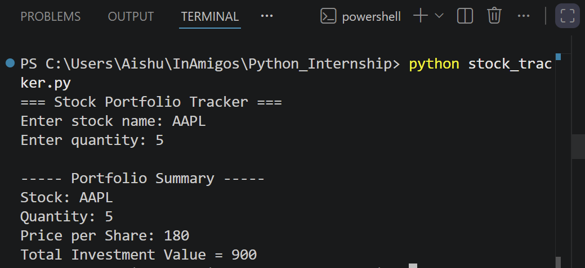

# Stock Portfolio Tracker

## Description
A simple Python application that calculates the total investment value of stocks based on user input and predefined stock prices.

## Features
- Accepts stock name and quantity from the user
- Uses a dictionary to store stock prices
- Calculates total investment value
- Displays a portfolio summary
- Handles invalid stock names

## Technologies Used
- Python 3

## How to Run

```bash
python stock_tracker.py
```

## Sample Input

AAPL
5

## Sample Output

Total Investment Value = 900

## Output Screenshot



## Author

Rashmitha
